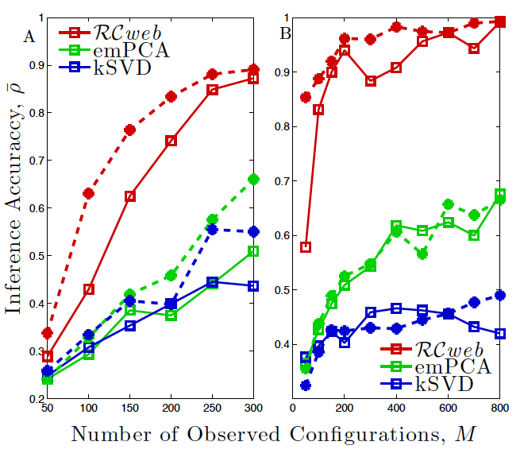
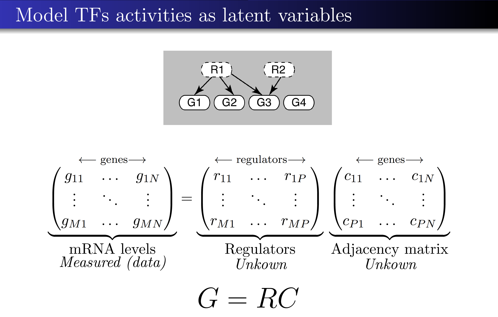

# Inference of Sparse Networks with Unobserved Variables

This repository contains code the RCweb algorythm that allows inference of sparse networks with unobserved variables given a set of noisy measurements of the observed variables.  The RCweb algorythm and its application to gene regulatory networks is described in [Slavov, Proceedings of Machine Learning Research (2010)](http://proceedings.mlr.press/v9/slavov10a.html). A brief overview of the algorythm was also presented at the [Biological systems: In search of direct causal mechanisms](https://youtu.be/P0-_gDUNikc).

## Functions and scripts reproducing the analysis reported by [Slavov, 2010](https://arxiv.org/abs/1406.0193)

## Man functions 
* SpAce.m
* SpAce_Path.m

## Supporting functions called by the main functions:
* pm.m -- Computes the largest eigenvector and eigenvalue of a matrix from initial guess 		
* inv_rank1_add.m -- Rank one (addition) update of an inverse 
* inv_rank1_red.m -- Rank one (subtraction) update of an inverse 	
* inv_rank1.m  -- Rank one update of an inverse addition or subtraction depending on the third argument 	
* inv_up.m	-- rank k update on an inverse 			

## Supporting functions called by the scripts:
data_Gen.m -- Simulates data from a model of a sparse network 
c_corr.m  -- Computes the the correlations between the most correlated columns of two matrices 		

## [Video presentaion of the RCweb algorythm applied to transcriptional networks](https://youtu.be/P0-_gDUNikc?t=4550)

## Correspondence
Questions can be directed to the [Slavov Laboratory](http://slavovlab.net/)  
